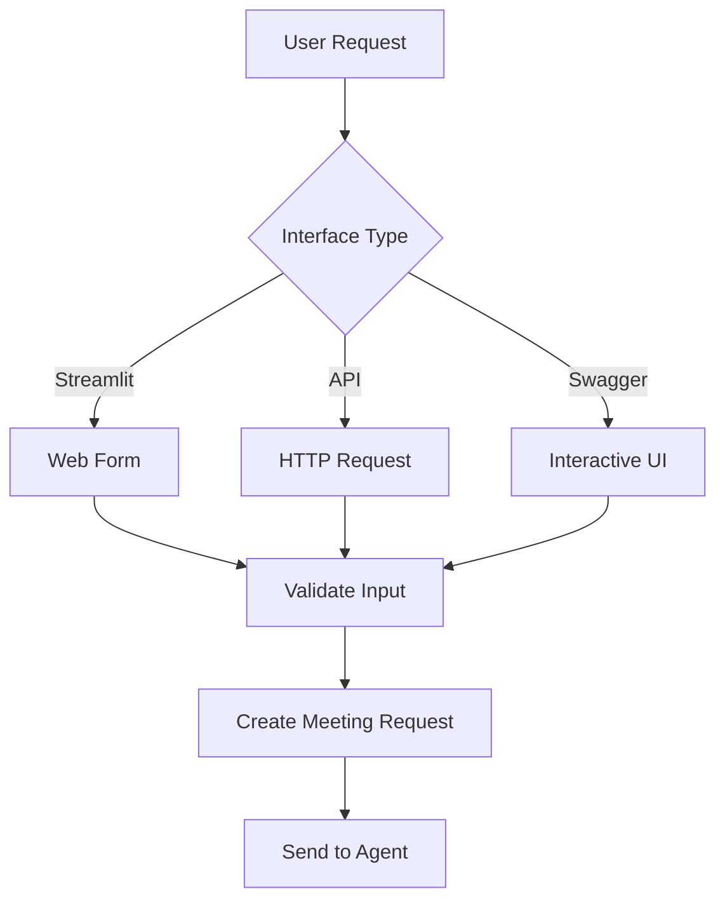
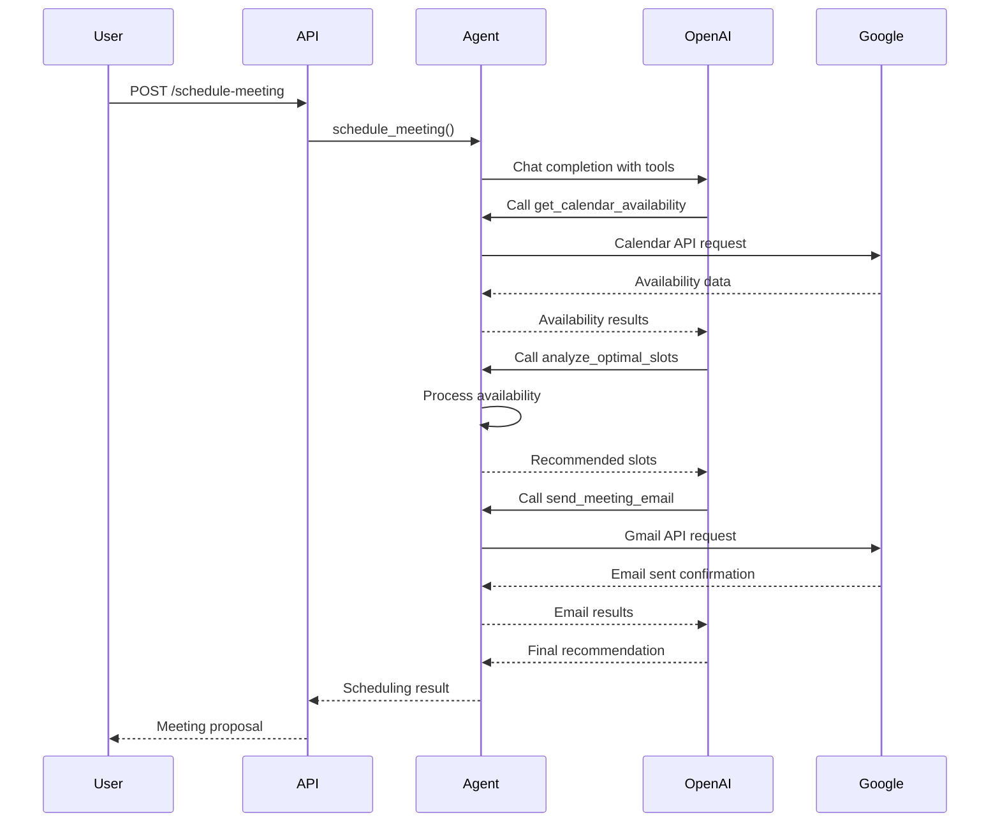
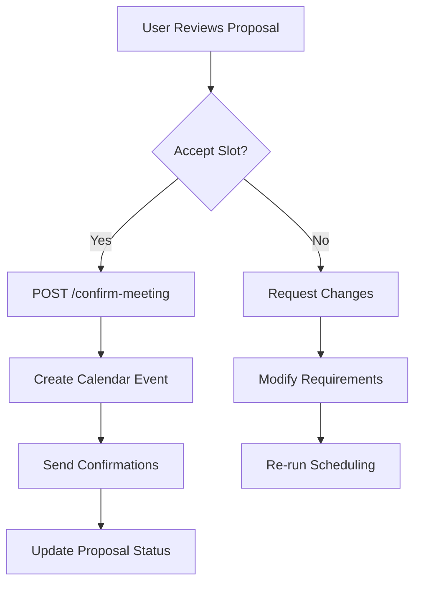

# SchedulAI - Complete Documentation

## 📋 **Table of Contents**
1. [Project Overview](#project-overview)
2. [Architecture](#architecture)
3. [Setup & Installation](#setup--installation)
4. [Authentication](#authentication)
5. [API Reference](#api-reference)
6. [Testing Guide](#testing-guide)
7. [Project Requirements](#project-requirements)
8. [Development Guidelines](#development-guidelines)

---

## 🚀 **Project Overview**

SchedulAI is an **autonomous meeting booking agent** that uses vLLM DeepSeek Function Calling to intelligently schedule meetings by integrating with Google Calendar and Gmail APIs. The system analyzes participant availability, suggests optimal time slots, and handles meeting coordination automatically.

### **Key Features**
- 🤖 **vLLM DeepSeek Integration** - AI agent with 5 specialized tools
- 📅 **Google Calendar Integration** - Real-time availability checking
- 📧 **Gmail Integration** - Automated meeting invitations and responses
- 🎯 **Smart Scheduling** - AI-powered slot optimization
- 🏗️ **Clean Architecture** - Layered design with domain separation
- 🔒 **Secure OAuth2** - Google API authentication

---

## 🏗️ **Architecture**

### **Layered Architecture Design**

```
SchedulAI/
├── run_scheduleai.py         # Application entry point
├── app/                      # Main application package
│   ├── main.py              # FastAPI app with factory pattern
│   ├── config.py            # Configuration management
│   ├── models/              # 📦 Domain Models
│   │   ├── __init__.py      # Centralized exports
│   │   ├── meeting.py       # Meeting-related models
│   │   ├── user.py          # User/participant models
│   │   ├── api.py           # API request/response models
│   │   └── agent.py         # AI agent models
│   ├── services/            # 🎯 Business Logic
│   │   ├── agent_service.py # AI scheduling logic
│   │   └── google_service.py# Google API integration
│   ├── api/                 # 🌐 API Layer
│   │   ├── dependencies.py  # Dependency injection
│   │   ├── middleware.py    # Request/response middleware
│   │   └── routes/          # Route handlers by domain
│   │       ├── health.py    # Health & status endpoints
│   │       ├── meetings.py  # Meeting management
│   │       └── calendar.py  # Calendar operations
│   ├── core/                # 🛠️ Core Utilities
│   │   ├── logging.py       # Centralized logging
│   │   └── exceptions.py    # Custom exceptions
│   └── utils/               # 🔧 Helper Utilities
│       └── validators.py    # Validation functions
└── requirements.txt         # Dependencies
```

### **Design Principles**

1. **Separation of Concerns** - Each layer has distinct responsibilities
2. **Dependency Injection** - Clean service management with FastAPI
3. **Domain-Driven Design** - Models organized by business domain
4. **Factory Pattern** - Clean application initialization
5. **Exception Handling** - Custom exception hierarchy

### **AI Agent Tools**

The SchedulAI agent uses 5 specialized vLLM function calling tools:

1. **`get_calendar_availability`** - Fetch participant availability
2. **`analyze_optimal_slots`** - AI-powered slot optimization
3. **`create_calendar_event`** - Calendar event management
4. **`send_meeting_email`** - Automated email communication
5. **`check_email_responses`** - Response parsing and tracking

---

## ⚙️ **Setup & Installation**

### **Prerequisites**
- Python 3.8+
- Google Cloud Project with Calendar & Gmail APIs enabled
- vLLM API account

### **Installation Steps**

1. **Clone and Setup Environment**
```bash
git clone <repository-url>
cd SchedulAI
python -m venv venv
source venv/bin/activate  # On Windows: venv\Scripts\activate
pip install -r requirements.txt
```

2. **Environment Configuration**
```bash
cp env.example .env
# Edit .env with your configuration
```

3. **Required Environment Variables**
```env
# vLLM Configuration
vLLM server=your_vLLM server
# vLLM model path configuration

# API Configuration
API_HOST=localhost
API_PORT=8000
DEBUG=true

# Google APIs
GOOGLE_CREDENTIALS_FILE=credentials.json
GOOGLE_TOKEN_FILE=token.pickle

# Feature Flags
ENABLE_EMAIL_SENDING=true
ENABLE_CALENDAR_CREATION=true
ENABLE_AI_REASONING=true
```

4. **Start the Application**
   ```bash
   # Method 1: Direct module execution (Recommended)
   python -m app.main
   
   # Method 2: Using uvicorn directly
   uvicorn app.main:app --host localhost --port 8000 --reload
   ```

The API will be available at: `http://localhost:8000`
- Swagger UI: `http://localhost:8000/docs`
- ReDoc: `http://localhost:8000/redoc`

---

## 🔐 **Authentication**

### **Google OAuth2 Setup**

1. **Create Google Cloud Project**
   - Go to [Google Cloud Console](https://console.cloud.google.com/)
   - Create a new project or select existing one

2. **Enable Required APIs**
   ```
   - Google Calendar API
   - Gmail API
   ```

3. **Create OAuth2 Credentials**
   - Go to "Credentials" → "Create Credentials" → "OAuth 2.0 Client IDs"
   - Application type: "Desktop application"
   - Download the JSON file as `credentials.json`

4. **Configure OAuth Consent Screen**
   - Add your email as a test user
   - Required scopes:
     ```
     https://www.googleapis.com/auth/calendar
     https://www.googleapis.com/auth/gmail.send
     https://www.googleapis.com/auth/gmail.readonly
     ```

5. **Authentication Flow**
   - First run opens browser for OAuth consent
   - Credentials saved to `token.pickle` for future use
   - Automatic token refresh when expired

### **vLLM Setup**

1. **Get API Key**
   - Create API key in your account settings

2. **Configure in Environment**
   ```env
   vLLM server=your_api_key_here
   # vLLM model path configuration
   ```

---

## 📡 **API Reference**

### **Base URL**
```
http://localhost:8000
```

### **Endpoints Overview**

| Method | Endpoint | Description |
|--------|----------|-------------|
| `GET` | `/` | API overview and available endpoints |
| `GET` | `/health` | System health check |
| `POST` | `/meetings/schedule` | Schedule a new meeting |
| `GET` | `/meetings/proposal/{id}` | Get meeting proposal status |
| `POST` | `/meetings/confirm/{id}` | Confirm a meeting proposal |
| `GET` | `/meetings/agent-tools` | List available AI tools |
| `GET` | `/calendar/upcoming` | Get upcoming meetings |
| `GET` | `/calendar/availability` | Check participant availability |
| `POST` | `/calendar/events` | Create calendar event |

### **Key API Models**

#### **Meeting Request**
```json
{
  "title": "Team Standup",
  "description": "Daily team synchronization meeting",
  "duration_minutes": 30,
  "organizer": {
    "name": "John Doe",
    "email": "john@company.com",
    "timezone": "America/New_York"
  },
  "participants": [
    {
      "name": "Jane Smith",
      "email": "jane@company.com",
      "timezone": "America/New_York"
    }
  ],
  "priority": "medium",
  "preferred_days": ["monday", "tuesday", "wednesday", "thursday", "friday"],
  "user_preferences": {
    "work_start_hour": 9,
    "work_end_hour": 18,
    "buffer_time_minutes": 15
  }
}
```

#### **Meeting Response**
```json
{
  "success": true,
  "proposal_id": "abc123-def456",
  "suggested_slots": [
    {
      "start_time": "2025-01-10T14:00:00",
      "end_time": "2025-01-10T14:30:00",
      "formatted": "Friday, January 10 at 02:00 PM - 02:30 PM"
    }
  ],
  "reasoning": "Selected slot avoids lunch hours and respects all participants' working hours.",
  "agent_message": "Found optimal time slot considering all constraints."
}
```

---

## 🧪 **Testing Guide**

### **Health Check**
```bash
curl http://localhost:8000/health | python -m json.tool
```

**Expected Response:**
```json
{
  "status": "healthy",
  "services": {
    "google_calendar": true,
    "gmail_api": true,
    "vllm_agent": true,
    "function_calling": true
  },
  "agent_tools_count": 5,
  "config": {
    "debug_mode": true,
    "log_level": "INFO"
  },
  "timestamp": "2025-01-05T10:00:00.000000"
}
```

### **Schedule Meeting Test**
```bash
curl -X POST http://localhost:8000/meetings/schedule \
  -H "Content-Type: application/json" \
  -d '{
    "title": "Test Meeting",
    "description": "API test meeting",
    "duration_minutes": 30,
    "organizer": {
      "name": "Test User",
      "email": "test@example.com"
    },
    "participants": [
      {
        "name": "Participant One",
        "email": "participant1@example.com"
      }
    ],
    "priority": "medium"
  }'
```

### **Agent Tools Test**
```bash
curl http://localhost:8000/meetings/agent-tools | python -m json.tool
```

**Expected Response:**
```json
{
  "tools": [
    {
      "name": "get_calendar_availability",
      "description": "Get calendar availability for participants in a date range",
      "parameters": ["participant_emails", "start_date", "end_date", "duration_minutes"]
    },
    {
      "name": "analyze_optimal_slots",
      "description": "Analyze availability data and recommend optimal meeting slots",
      "parameters": ["availability_data", "meeting_requirements", "max_suggestions"]
    },
    {
      "name": "create_calendar_event",
      "description": "Create a calendar event for confirmed meeting",
      "parameters": ["title", "description", "start_time", "end_time", "attendees", "location"]
    },
    {
      "name": "send_meeting_email",
      "description": "Send meeting proposal or confirmation email",
      "parameters": ["to", "subject", "body", "html_body", "email_type"]
    },
    {
      "name": "check_email_responses",
      "description": "Check for email responses related to meeting proposals",
      "parameters": ["proposal_id", "query", "max_results"]
    }
  ],
  "total_tools": 5
}
```

### **Calendar Availability Test**
```bash
curl "http://localhost:8000/calendar/availability?participant_emails=test@example.com&days_ahead=7&duration_minutes=30"
```

### **Upcoming Meetings Test**
```bash
curl http://localhost:8000/calendar/upcoming?days_ahead=7 | python -m json.tool
```

---

## 📋 **Project Requirements**

### **Functional Requirements**

1. **Meeting Scheduling**
   - Accept meeting requests with multiple participants
   - Check calendar availability for all attendees
   - Suggest optimal time slots using AI analysis
   - Handle timezone differences
   - Support meeting priorities and preferences

2. **Calendar Integration**
   - Read calendar events to check availability
   - Create calendar events for confirmed meetings
   - Update existing events when needed
   - Handle recurring events and conflicts

3. **Email Management**
   - Send meeting proposals via email
   - Parse email responses for confirmations
   - Send meeting confirmations and updates
   - Handle email threading for conversations

4. **AI-Powered Features**
   - Intelligent slot optimization
   - Natural language processing for preferences
   - Conflict resolution suggestions
   - Meeting pattern learning (future)

### **Non-Functional Requirements**

1. **Performance**
   - API response time < 2 seconds for scheduling
   - Support up to 20 participants per meeting
   - Handle 100+ requests per minute

2. **Security**
   - OAuth2 authentication for Google APIs
   - Secure API key management
   - Input validation and sanitization
   - HTTPS in production

3. **Reliability**
   - 99.9% uptime target
   - Graceful error handling
   - Automatic retry mechanisms
   - Comprehensive logging

4. **Scalability**
   - Horizontal scaling support
   - Database-ready architecture
   - Caching capabilities
   - Load balancing ready

### **Technical Constraints**

- Python 3.8+ required
- vLLM DeepSeek model recommended
- Google Workspace or Gmail account needed
- Internet connectivity required for APIs

---

## 👨‍💻 **Development Guidelines**

### **Code Style**
- Follow PEP 8 Python style guidelines
- Use type hints throughout the codebase
- Comprehensive docstrings for all functions
- Maximum line length: 88 characters

### **Git Workflow**
- Feature branches for new development
- Descriptive commit messages
- Pull request reviews required
- Automated testing on commits

### **Error Handling**
- Use custom exception hierarchy
- Log all errors with context
- Return meaningful error messages
- Implement proper HTTP status codes

### **Testing Strategy**
- Unit tests for all business logic
- Integration tests for API endpoints
- Mock external services in tests
- Minimum 80% code coverage

### **Logging Standards**
```python
import logging
from app.core.logging import get_logger

logger = get_logger(__name__)

# Use appropriate log levels
logger.debug("Detailed debugging information")
logger.info("General information about application flow")
logger.warning("Warning about potential issues")
logger.error("Error occurred but application continues")
logger.critical("Critical error requiring immediate attention")
```

### **Environment Management**
- Use environment variables for configuration
- Never commit secrets to version control
- Provide example configuration files
- Document all required environment variables

---

## 🚀 **Production Deployment**

### **Environment Setup**
```env
DEBUG=false
LOG_LEVEL=WARNING
API_HOST=0.0.0.0
API_PORT=8000
ENABLE_EMAIL_SENDING=true
ENABLE_CALENDAR_CREATION=true
```

### **Security Considerations**
- Use HTTPS in production
- Implement rate limiting
- Set up proper CORS policies
- Regular security audits
- Keep dependencies updated

### **Monitoring**
- Health check endpoints
- Application performance monitoring
- Error tracking and alerting
- Usage analytics
- Resource utilization monitoring

---

## 📞 **Support & Troubleshooting**

### **Common Issues**

1. **Authentication Errors**
   - Check Google OAuth2 setup
   - Verify API credentials
   - Ensure required scopes are granted

2. **Calendar API Errors**
   - Verify calendar permissions
   - Check participant email addresses
   - Validate date/time formats

3. **vLLM API Issues**
   - Confirm API key validity
   - Check rate limits
   - Verify model availability

### **Debug Mode**
Set `DEBUG=true` in environment for detailed logging and error messages.

### **Log Files**
Application logs are stored in `logs/scheduleai.log` with automatic rotation.

---

**Version:** 1.0.0  
**Last Updated:** January 2025  
**License:** MIT 


# SchedulAI Project Requirements & Function Flow

## 📋 Project Overview

**SchedulAI** is an autonomous meeting booking agent that uses vLLM DeepSeek to intelligently schedule meetings by analyzing calendar availability, sending professional emails, and creating calendar events automatically.

## 🎯 Core Requirements

### **Functional Requirements**

#### 1. **Meeting Scheduling Intelligence**
- **Requirement**: AI agent must autonomously analyze participant availability
- **Implementation**: vLLM DeepSeek with function calling tools
- **Capability**: Multi-participant calendar conflict resolution

#### 2. **Google Services Integration**
- **Calendar API**: Read/write calendar events and availability
- **Gmail API**: Send professional meeting invitations and confirmations
- **OAuth2**: Secure authentication with user consent

#### 3. **AI-Powered Decision Making**
- **Slot Analysis**: Intelligent time slot recommendations based on preferences
- **Conflict Resolution**: Handle overlapping meetings and time zone differences
- **Reasoning**: Provide explanations for scheduling decisions

#### 4. **Multi-Interface Support**
- **FastAPI Backend**: RESTful API with Swagger documentation
- **Streamlit Frontend**: User-friendly web interface
- **Direct API**: Programmatic access for integration

#### 5. **Configuration Management**
- **Environment Variables**: Secure credential and setting management
- **Feature Flags**: Enable/disable functionality dynamically
- **Logging**: Comprehensive activity tracking

### **Non-Functional Requirements**

#### 1. **Security**
- OAuth2 authentication for Google services
- Server protection for vLLM
- Input validation and sanitization
- Secure credential storage

#### 2. **Performance**
- Response time < 5 seconds for meeting scheduling
- Support for multiple concurrent requests
- Efficient API quota management

#### 3. **Reliability**
- Error handling and graceful degradation
- Retry mechanisms for external API calls
- Comprehensive logging for debugging

#### 4. **Scalability**
- Modular architecture for easy extension
- Stateless design for horizontal scaling
- Plugin architecture for new services

## 🏗️ System Architecture

### **Core Components**

```
┌─────────────────┐    ┌──────────────────┐    ┌─────────────────┐
│   User Interface │    │   FastAPI Server │    │  vLLM Agent   │
│                 │    │                  │    │                 │
│  • Streamlit    │◄──►│  • REST API      │◄──►│  • GPT-4        │
│  • Swagger UI   │    │  • Endpoints     │    │  • Function     │
│  • Direct API   │    │  • Middleware    │    │    Calling      │
└─────────────────┘    └──────────────────┘    └─────────────────┘
                                 │
                                 ▼
┌─────────────────┐    ┌──────────────────┐    ┌─────────────────┐
│  Google Services│    │   Data Models    │    │   Configuration │
│                 │    │                  │    │                 │
│  • Calendar API │    │  • Pydantic      │    │  • Environment  │
│  • Gmail API    │    │  • Validation    │    │  • Secrets      │
│  • OAuth2       │    │  • Serialization │    │  • Feature Flags│
└─────────────────┘    └──────────────────┘    └─────────────────┘
```

### **Technology Stack**

| Component | Technology | Purpose |
|-----------|------------|---------|
| **AI Engine** | vLLM DeepSeek | Function calling and decision making |
| **Backend** | FastAPI | RESTful API server |
| **Frontend** | Streamlit | Web interface |
| **Calendar** | Google Calendar API | Event management |
| **Email** | Gmail API | Communication |
| **Auth** | OAuth2 | Secure authentication |
| **Data** | Pydantic | Validation and modeling |
| **Config** | Python-dotenv | Environment management |

## 🔄 Complete Function Flow

### **Phase 1: User Request Initiation**



**1.1 User Input Collection**
```python
# Meeting Request Structure
{
    "title": "Weekly Team Sync",
    "description": "Discuss project progress",
    "duration_minutes": 60,
    "participants": [
        {
            "name": "John Doe",
            "email": "john@company.com",
            "timezone": "America/New_York"
        }
    ],
    "priority": "high",
    "preferred_days": ["Monday", "Tuesday", "Wednesday"],
    "user_preferences": {
        "work_start_hour": 9,
        "work_end_hour": 17,
        "buffer_time_minutes": 15
    }
}
```

### **Phase 2: AI Agent Processing**

**2.1 Agent Initialization**
```python
# Agent receives request and analyzes requirements
agent = SchedulingAgent()
result = agent.schedule_meeting(meeting_request, user_preferences)
```

**2.2 vLLM DeepSeek Function Calling Sequence**



### **Phase 3: Detailed Function Execution**

#### **3.1 Calendar Availability Analysis**

**Function**: `get_calendar_availability`
```python
def _get_calendar_availability(self, participant_emails, start_date, end_date, duration_minutes):
    """
    Flow:
    1. Query Google Calendar API for each participant
    2. Retrieve busy time blocks
    3. Calculate free time slots
    4. Apply duration constraints
    5. Return structured availability data
    """
```

**Process**:
1. **API Call**: `calendar.freebusy().query()` for each participant
2. **Data Processing**: Convert busy periods to TimeSlot objects
3. **Free Slot Calculation**: Find gaps between busy periods
4. **Duration Filtering**: Remove slots shorter than required duration
5. **Return**: Structured availability response

#### **3.2 Optimal Slot Analysis**

**Function**: `analyze_optimal_slots`
```python
def _analyze_optimal_slots(self, availability_data, meeting_requirements, max_suggestions=3):
    """
    Flow:
    1. Combine all participant availabilities
    2. Find overlapping free time slots
    3. Score slots based on preferences
    4. Rank by optimal criteria
    5. Return top recommendations
    """
```

**Scoring Criteria**:
- **Time Preferences**: Work hours alignment (weight: 0.3)
- **Day Preferences**: Preferred days match (weight: 0.2)
- **Buffer Time**: Adequate spacing (weight: 0.2)
- **Participant Count**: All attendees available (weight: 0.3)

#### **3.3 Email Communication**

**Function**: `send_meeting_email`
```python
def _send_meeting_email(self, to, subject, body, html_body="", email_type="proposal"):
    """
    Flow:
    1. Create professional email content
    2. Format HTML version
    3. Send via Gmail API
    4. Track delivery status
    5. Return confirmation
    """
```

**Email Types**:
- **Proposal**: Initial meeting suggestions
- **Confirmation**: Meeting confirmed notification
- **Cancellation**: Meeting cancelled notice
- **Reminder**: Meeting reminder before event

#### **3.4 Calendar Event Creation**

**Function**: `create_calendar_event`
```python
def _create_calendar_event(self, title, description, start_time, end_time, attendees, location=""):
    """
    Flow:
    1. Format event details
    2. Create calendar event via API
    3. Add attendees with notifications
    4. Set meeting location/link
    5. Return event ID
    """
```

### **Phase 4: Response Generation**

#### **4.1 Meeting Proposal Creation**
```python
# Generated Response Structure
{
    "success": True,
    "proposal_id": "uuid-12345",
    "message": "Meeting proposal created successfully",
    "suggested_slots": [
        {
            "index": 0,
            "start_time": "2024-01-15T10:00:00",
            "end_time": "2024-01-15T11:00:00",
            "formatted": "Monday, January 15 at 10:00 AM - 11:00 AM",
            "confidence_score": 0.95
        }
    ],
    "reasoning": "Selected Monday 10 AM as it aligns with all participants' work hours and preferred days",
    "participants_notified": True,
    "email_sent": True
}
```

#### **4.2 Proposal Management**
```python
# Proposal Storage and Tracking
class MeetingProposal:
    proposal_id: str
    meeting_request: MeetingRequest
    suggested_slots: List[TimeSlot]
    status: str  # pending, confirmed, cancelled
    reasoning: str
    confidence_scores: List[float]
    created_at: datetime
```

### **Phase 5: User Confirmation Flow**

#### **5.1 Proposal Review**


#### **5.2 Meeting Confirmation**
```python
# Confirmation Process
def confirm_meeting(self, proposal_id: str, selected_slot_index: int):
    """
    Flow:
    1. Retrieve proposal by ID
    2. Get selected time slot
    3. Create calendar event
    4. Send confirmation emails
    5. Update proposal status
    6. Return confirmation details
    """
```

## 🛠️ API Endpoints

### **Core Scheduling Endpoints**

| Endpoint | Method | Purpose | Input | Output |
|----------|--------|---------|-------|--------|
| `/schedule-meeting` | POST | Create meeting proposal | Meeting details | Proposal with time slots |
| `/confirm-meeting/{id}` | POST | Confirm selected slot | Proposal ID + slot index | Confirmation details |
| `/proposal/{id}` | GET | Get proposal status | Proposal ID | Current proposal state |

### **Information Endpoints**

| Endpoint | Method | Purpose | Output |
|----------|--------|---------|--------|
| `/health` | GET | System health check | Service status |
| `/agent-tools` | GET | Available AI tools | Tool descriptions |
| `/upcoming-meetings` | GET | Calendar events | Meeting list |
| `/calendar-availability` | GET | Check availability | Free time slots |

### **Utility Endpoints**

| Endpoint | Method | Purpose | Output |
|----------|--------|---------|--------|
| `/` | GET | API overview | System information |
| `/check-email-responses/{id}` | POST | Check email replies | Response analysis |
| `/natural-language-schedule` | POST | Future NLP endpoint | Parsed request |

## 🔧 Configuration Requirements

### **Environment Variables**

```bash
# Required Configuration
vLLM server=sk-...                    # vLLM API access
GOOGLE_CREDENTIALS_FILE=credentials.json # Google OAuth credentials
GOOGLE_TOKEN_FILE=token.pickle          # Generated OAuth token

# Optional Configuration
API_HOST=localhost                       # Server host
API_PORT=8000                           # Server port
DEBUG=true                              # Debug mode
LOG_LEVEL=INFO                          # Logging level

# Feature Flags
ENABLE_EMAIL_SENDING=true               # Email functionality
ENABLE_CALENDAR_CREATION=true           # Calendar events
ENABLE_AI_REASONING=true                # AI explanations

# Scheduling Defaults
DEFAULT_MEETING_DURATION=30             # Minutes
DEFAULT_WORK_START_HOUR=9               # 24-hour format
DEFAULT_WORK_END_HOUR=18                # 24-hour format
DEFAULT_TIMEZONE=UTC                    # Timezone
```

### **Google Cloud Setup Requirements**

1. **Google Cloud Project** with billing enabled
2. **APIs Enabled**:
   - Google Calendar API
   - Gmail API
   - Google+ API (for user info)
3. **OAuth 2.0 Client ID** configured
4. **OAuth Consent Screen** with required scopes
5. **Test Users** added for development

### **Dependencies**

```txt
# Core Framework
fastapi>=0.104.1
uvicorn[standard]>=0.24.0

# AI & ML
openai>=1.3.0

# Google Services
google-auth>=2.23.4
google-auth-oauthlib>=1.1.0
google-auth-httplib2>=0.1.1
google-api-python-client>=2.108.0

# Data & Validation
pydantic>=2.5.0
python-multipart>=0.0.6

# Utilities
python-dotenv>=1.0.0
requests>=2.31.0
pytz>=2023.3

# Development
streamlit>=1.28.0
```

## 🎯 Success Criteria

### **Functional Success**
- ✅ User can request meeting scheduling
- ✅ AI agent analyzes calendar availability
- ✅ System suggests optimal time slots
- ✅ Professional emails are sent automatically
- ✅ Calendar events are created upon confirmation
- ✅ All participants receive appropriate notifications

### **Technical Success**
- ✅ All 5 vLLM DeepSeek Function Calling tools operational
- ✅ Google Calendar and Gmail APIs integrated
- ✅ FastAPI server with Swagger documentation
- ✅ Streamlit interface for user interaction
- ✅ Comprehensive error handling and logging
- ✅ Secure credential management

### **User Experience Success**
- ✅ Intuitive interface for meeting requests
- ✅ Clear explanations of scheduling decisions
- ✅ Professional email communications
- ✅ Reliable calendar integration
- ✅ Quick response times (< 5 seconds)

This comprehensive flow ensures that SchedulAI provides an intelligent, automated, and user-friendly meeting scheduling experience from request to confirmation. 